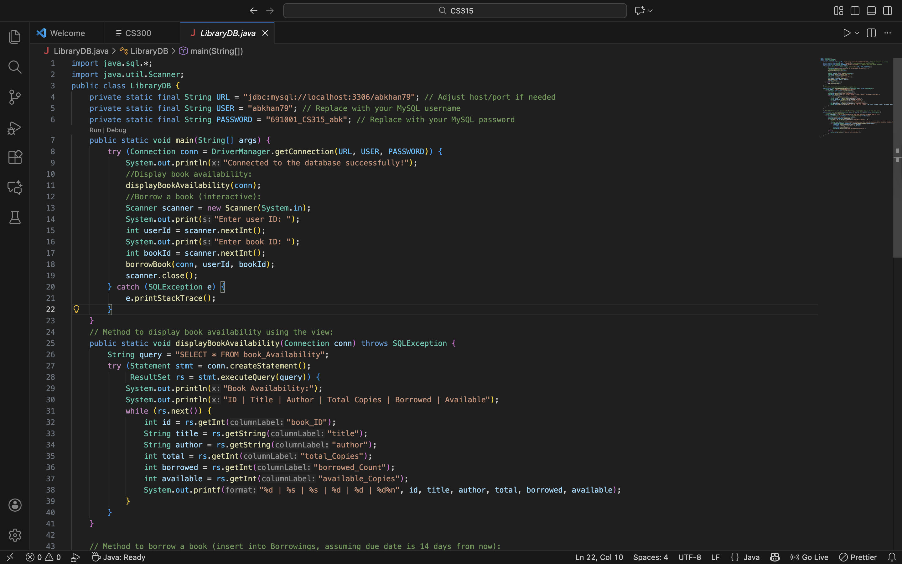
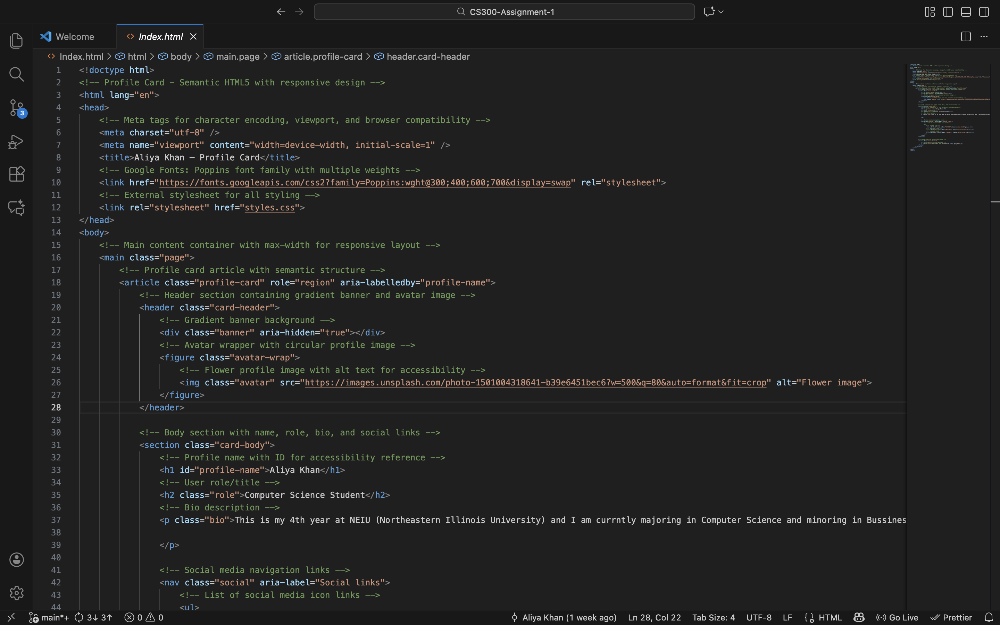

# Aliya Khan - Portfolio Website

## 👤 About
**Name:** Aliya Khan  
**Role:** Computer Science Major | Business Analytics Minor  
**University:** Northeastern Illinois University

## 🌐 Live Site
[View Live Portfolio](https://github.com/abkhan79/Aliya_Khan_Portfolio.git) <!-- Update with your actual live URL -->

## 📝 Description
A personal portfolio website showcasing my projects, skills, and experience as a Computer Science student. This portfolio demonstrates my web development capabilities and highlights my academic and personal projects.

## 🚀 Technologies Used

### Frontend
- **HTML5** - Semantic markup for structured content
- **CSS3** - Custom styling with modern design principles
- **JavaScript** - Interactive features and dynamic functionality

### Design & UX
- **Responsive Design** - Mobile-first approach with breakpoints for all devices
- **Google Fonts** - Poppins font family for modern typography
- **CSS Grid & Flexbox** - Modern layout techniques
- **Smooth Scrolling** - Enhanced navigation experience

### Features & Functionality
- Mobile-responsive navigation menu
- Interactive project cards
- Smooth scroll animations
- Contact form integration
- Accessibility-focused design

## ✨ Special Features

### 🎨 Design Highlights
- **Gradient Backgrounds** - Eye-catching visual elements with modern gradient effects
- **Responsive Navigation** - Mobile-friendly hamburger menu with smooth transitions
- **Dark Theme** - Professional dark color scheme optimized for readability
- **Interactive Animations** - Scroll-triggered animations for engaging user experience
- **Glassmorphism Effects** - Modern UI design with frosted glass aesthetics

### 💡 Technical Highlights
- **Semantic HTML5** - Proper use of semantic elements for SEO and accessibility
- **CSS Custom Properties** - Maintainable styling with CSS variables
- **Smooth Scroll Navigation** - JavaScript-powered smooth scrolling between sections
- **Form Validation** - Client-side validation for contact form
- **Mobile-First Development** - Optimized for mobile devices with progressive enhancement
- **Cross-Browser Compatibility** - Tested across major browsers

### 📱 Responsive Breakpoints
- Mobile: 320px - 768px
- Tablet: 768px - 1024px
- Desktop: 1024px+

## 📂 Project Structure
```
Aliya_Khan_Portfolio/
├── Index.html              # Main HTML structure
├── Style.css               # Styling and responsive design
├── Script.js               # JavaScript functionality
├── profile-image.jpg       # Personal profile photo
├── project1-screenshot.jpg # LibraryDB project preview
├── project2-screenshot.jpg # Profile Card project preview
└── README.md              # Project documentation
```

## 🎯 Featured Projects

### 1. LibraryDB
A comprehensive library management system with database integration, featuring book availability tracking, borrowing management, and user account functionality.
- **Technologies:** Java, SQL, MySQL, Database Design

### 2. Profile Card
A semantic HTML profile card with responsive design showcasing user information, bio, role, and social media links.
- **Technologies:** HTML5, CSS3, Semantic Markup, Responsive Design

## 📸 Screenshots

### Homepage - Hero Section

*Clean, professional introduction with call-to-action buttons*

### Projects Section

*Interactive project cards with detailed information*

### Mobile Responsive Design
The portfolio is fully responsive across all devices with an optimized mobile navigation experience.

## 🛠️ Installation & Setup

1. **Clone the repository**
   ```bash
   git clone https://github.com/abkhan79/Aliya_Khan_Portfolio.git
   ```

2. **Navigate to the project directory**
   ```bash
   cd Aliya_Khan_Portfolio
   ```

3. **Open in browser**
   ```bash
   open Index.html
   # or simply double-click Index.html
   ```

No build process or dependencies required - pure HTML, CSS, and JavaScript!

## 📧 Contact

Feel free to reach out to discuss projects, opportunities, or collaborations!

- **Email:** mailforaliya.2018@gmail.com <!-- Update with your actual email -->

- **GitHub:** [https://github.com/abkhan79/Aliya_Khan_Portfolio.git](#) <!-- Update with your GitHub URL -->

## 📄 License

This project is open source and available under the [MIT License](LICENSE).

---

**© 2026 Aliya Khan. All rights reserved.**
